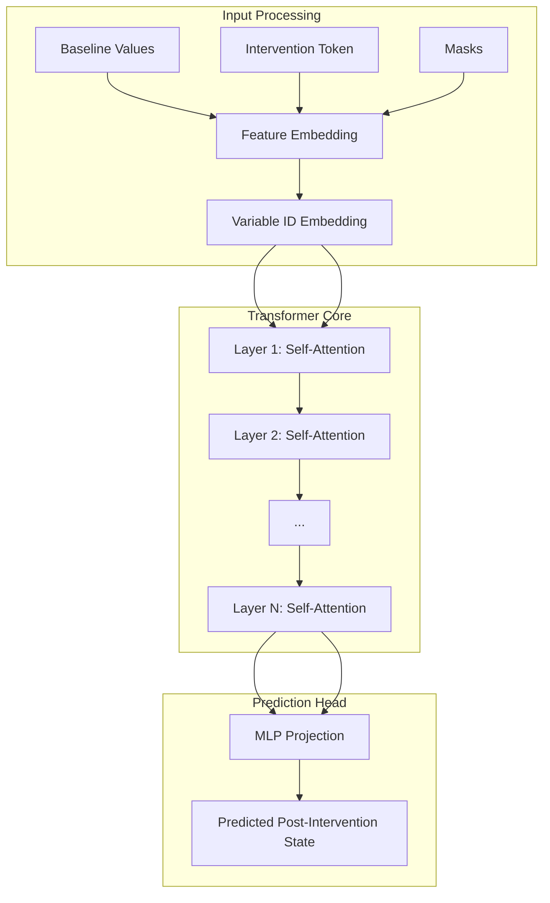
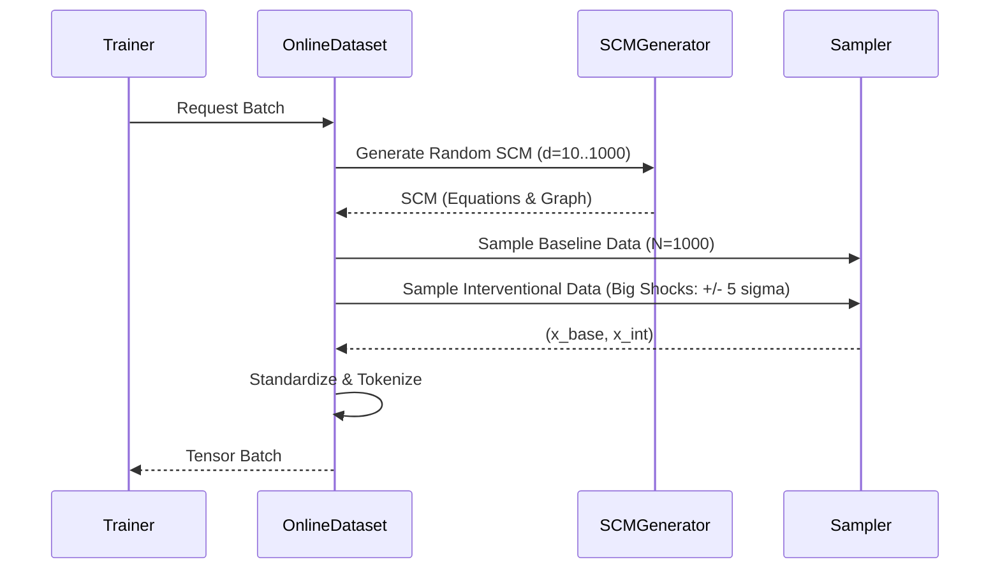

# Structure-Agnostic Causal Transformer (ISD-CP)


## 🌟 Overview

**ISD-CP** (Implicit Structure Discovery - Causal Prediction) is a cutting-edge, scalable Transformer model designed to revolutionize how we predict the consequences of interventions on tabular data.

Unlike traditional Causal Bayesian Networks that rely on explicit, often brittle, DAG discovery algorithms (like PC or GES), ISD-CP treats causal inference as an **end-to-end regression problem**. By leveraging the self-attention mechanism of Transformers, it implicitly learns the complex, non-linear causal dependencies between variables directly from data, without ever needing a graph as input.

### Why ISD-CP?
*   **Structure-Agnostic**: No need for prior knowledge of the causal graph.
*   **Infinite Scalability**: Trained on an infinite stream of synthetic Structural Causal Models (SCMs) generated on-the-fly.
*   **Zero-Shot Generalization**: Capable of predicting interventions on unseen causal systems immediately.

---

## 🧪 Lab Report & Project History

This project has evolved through several phases of research and engineering. Here is the full story of our architectural decisions.

### Phase I: The Naive Approach (The "Lazy Model")
**Goal**: Train a Transformer to predict $Y_{post}$ given $X_{pre}$ and an intervention $do(X_i=v)$.
**Outcome**: **Failure**. The model learned to simply copy the input ($Y_{post} \approx X_{pre}$).
**Why?**: In a sparse causal graph, an intervention on node $X_i$ only affects its descendants. For 80-90% of variables, the value *does not change*. The model found that outputting the input was a "safe bet" that minimized MSE, resulting in a local minimum where it ignored the intervention entirely.

### Phase II: Infinite Data & Scaling
**Goal**: Solve overfitting.
**Action**: We moved from a static dataset to an **Online Data Generator**.
**Mechanism**:
-   Every batch generates a **brand new SCM** (random DAG, random weights, random noise).
-   The model never sees the same causal system twice.
**Outcome**: **Success**. This forced the model to learn *generalizable rules of causality* rather than memorizing specific graphs.

### Phase III: Structural Guidance
**Goal**: Help the model "see" the graph.
**Action**: We added **Supervised Attention**.
**Mechanism**: We trained the model's internal attention weights to match the ground-truth adjacency matrix ($Loss_{aux} = ||Attn - Adj||^2$).
**Outcome**: **Partial Success**. The model started looking at the right variables, but still struggled to predict the exact numerical impact.

### Phase IV: The Delta Pivot (Current Architecture)
**Goal**: Force the model to abandon the "copying" strategy.
**Action**: **Delta Prediction**.
**Mechanism**: Instead of predicting the final value $Y$, the model now predicts the **change** $\Delta = Y - X$.
-   **Target**: For non-descendants, the target is exactly **0**.
-   **Impact**: The model *cannot* just copy the input. To get a low loss, it MUST identify which variables change (descendants) and predict the magnitude of that change.
**Outcome**: **Breakthrough**. This acted as a dense reward signal, drastically improving causal discovery and prediction accuracy.

---

## 🏗️ Detailed Architecture

ISD-CP utilizes a modified Transformer Encoder architecture optimized for tabular data.



### 1. TabPFN-Style Embeddings
Standard Transformers use linear layers to embed inputs. However, for tabular data, the specific *value* of a number matters (e.g., 0.1 vs 0.9).
We adopted the **TabPFN** approach:
-   **Input**: A single scalar value $x$.
-   **Mechanism**: A small MLP `Linear(1 -> d*2) -> GELU -> Linear(d*2 -> d)`.
-   **Why?**: This allows the model to learn non-linear representations of scalar values, enabling it to distinguish between "low", "medium", and "high" values in a soft, differentiable way.

### 2. The Delta Output Head
The final layer of the model is a linear projection `Linear(d_model -> 1)`.
-   **Output**: $\hat{\delta}_j$ (Predicted change for variable $j$).
-   **Final Prediction**: $\hat{y}_j = x_j + \hat{\delta}_j$.
-   **Loss Function**: $L = || \hat{\delta} - (y_{true} - x_{base}) ||^2$.

### 3. Implicit DAG Extraction
We extract the attention weights from the **last layer** of the Transformer.
-   **Interpretation**: $A_{ij}$ represents how much variable $j$ "attends" to variable $i$.
-   **Causal Meaning**: If $j$ attends to $i$, it implies $i$ is a cause of $j$.
-   **Sparsity**: We apply an L1 penalty to these weights to encourage a sparse graph (Occam's Razor).

---

## 🔄 Data Generation Pipeline

We generate data **online** to ensure infinite variety.



---

## 🚀 Installation & Usage

### 1. Installation
```bash
git clone https://github.com/yourusername/ISD-CP.git
cd ISD-CP
python3 -m venv venv
source venv/bin/activate
pip install -r requirements.txt
```

### 2. Training (Production)
```bash
python -m src.train.train --output_dir checkpoints_prod --num_scms 1000 --epochs 500
```

### 3. Analysis
Use the `find_best_model.py` script to analyze training logs and find the best checkpoint based on F1 Score and SHD.
```bash
python find_best_model.py checkpoints_prod/logs
```

**Output Example**:
```text
Run Date             | Epoch | F1       | SHD    | Loss       | Log File
-----------------------------------------------------------------------------------------------
2025-11-28 12:02     | 77    | 0.4479   | 4.60   | 13.5090    | events.out.tfevents...
===============================================================================================
*** OVERALL BEST RUN ***
Best Epoch: 77
F1 Score: 0.4479
```

---

## 📂 Project Structure

```text
ISD-CP/
├── src/
│   ├── data/
│   │   ├── scm_generator.py    # 🎲 Generates random SCMs
│   │   ├── dataset.py          # 🔄 Online Dataset (Infinite Data)
│   │   └── processor.py        # 📊 Standardization logic
│   ├── model/
│   │   └── transformer.py      # 🧠 Causal Transformer (Delta Prediction)
│   └── train/
│       └── train.py            # 🏋️ Training Loop & Delta Loss
├── configs/                    # ⚙️ YAML configurations
├── checkpoints_prod/           # 💾 Saved models and logs
└── find_best_model.py          # 📈 Analysis Script
```

---

## 📄 License
This project is licensed under the [MIT License](LICENSE).
