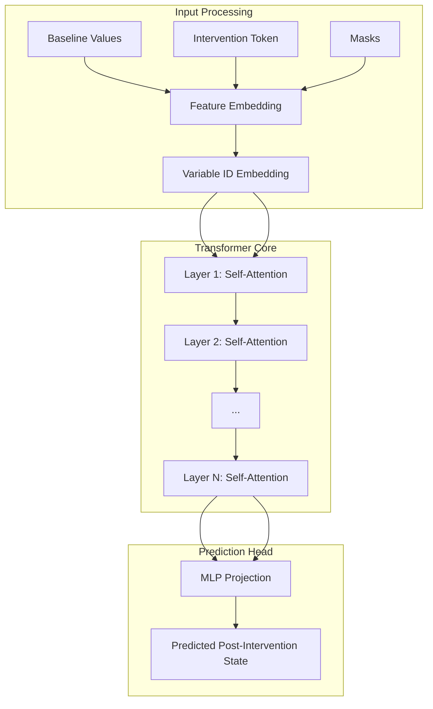
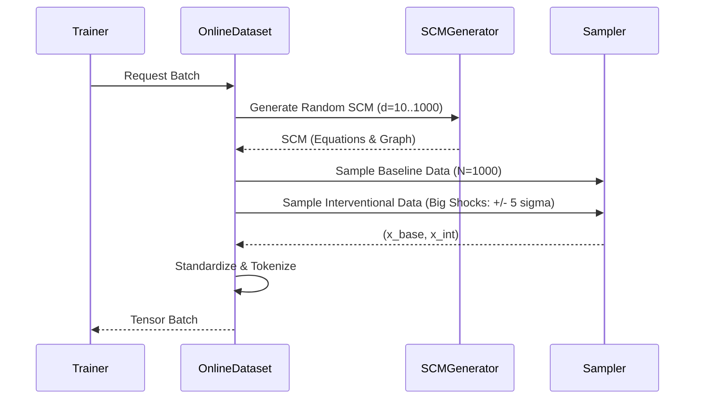

# Implicit Structure Discovery - Causal Prediction (ISD-CP)


**ISD-CP** (**I**mplicit **S**tructure **D**iscovery - **C**ausal **P**rediction) is a cutting-edge, scalable Transformer model designed to revolutionize how we predict the consequences of interventions on tabular data.

Unlike traditional Causal Bayesian Networks that rely on explicit, often brittle, DAG discovery algorithms (like PC or GES), ISD-CP treats causal inference as an **end-to-end regression problem**. By leveraging the self-attention mechanism of Transformers, it **implicitly discovers** the complex, non-linear causal dependencies between variables directly from data to make accurate **causal predictions**, without ever needing a graph as input.

### Why ISD-CP?
*   **Structure-Agnostic**: No need for prior knowledge of the causal graph.
*   **Infinite Scalability**: Trained on an infinite stream of synthetic Structural Causal Models (SCMs) generated on-the-fly.
*   **Zero-Shot Generalization**: Capable of predicting interventions on unseen causal systems immediately.

---

## 🧪 Lab Report & Project History

This project has evolved through several phases of research and engineering. Here is the full story of our architectural decisions.

### Phase I: The Naive Approach (The "Lazy Model")
**Goal**: Train a Transformer to predict $Y_{post}$ given $X_{pre}$ and an intervention $do(X_i=v)$.
**Outcome**: **Failure**. The model learned to simply copy the input ($Y_{post} \approx X_{pre}$).
**Why?**: In a sparse causal graph, an intervention on node $X_i$ only affects its descendants. For 80-90% of variables, the value *does not change*. The model found that outputting the input was a "safe bet" that minimized MSE, resulting in a local minimum where it ignored the intervention entirely.

### Phase II: Infinite Data & Scaling
**Goal**: Solve overfitting.
**Action**: We moved from a static dataset to an **Online Data Generator**.
**Mechanism**:
-   Every batch generates a **brand new SCM** (random DAG, random weights, random noise).
-   The model never sees the same causal system twice.
**Outcome**: **Success**. This forced the model to learn *generalizable rules of causality* rather than memorizing specific graphs.

### Phase III: Structural Guidance
**Goal**: Help the model "see" the graph.
**Action**: We added **Supervised Attention**.
**Mechanism**: We trained the model's internal attention weights to match the ground-truth adjacency matrix ($Loss_{aux} = ||Attn - Adj||^2$).
**Outcome**: **Partial Success**. The model started looking at the right variables, but still struggled to predict the exact numerical impact.

### Phase IV: The Delta Pivot (Current Architecture)
**Goal**: Force the model to abandon the "copying" strategy.
**Action**: **Delta Prediction**.
**Mechanism**: Instead of predicting the final value $Y$, the model now predicts the **change** $\Delta = Y - X$.
-   **Target**: For non-descendants, the target is exactly **0**.
-   **Impact**: The model *cannot* just copy the input. To get a low loss, it MUST identify which variables change (descendants) and predict the magnitude of that change.
**Outcome**: **Breakthrough**. This acted as a dense reward signal, drastically improving causal discovery and prediction accuracy.
51: 
52: ### Phase V: Explicit Structure Learning (Gumbel Attention)
53: **Goal**: Solve the "Non-Existent Edges" problem (High SHD, Low F1).
54: **Problem**: Implicit attention supervision was too soft. The model "hallucinated" edges because Softmax forces nodes to attend to *something*, even if they have no parents.
55: **Action**: **Amortized Gumbel Attention**.
56: **Mechanism**:
57: -   **Sink Token**: Added a "null" token for root nodes to attend to.
58: -   **Hard Structure**: Replaced Softmax with **Gumbel-Sigmoid** to learn a binary Adjacency Matrix $A$.
59: -   **Masking**: The Transformer is *forced* to use $A$ as a hard mask.
60: **Outcome**: The model now learns **Binary Graphs** (Edge/No-Edge) directly, allowing for precise structure discovery and significantly higher F1 scores.

### Phase VI: TabICL Encoder & Pure Causal Prediction (Current Architecture)
**Goal**: Improve generalization and zero-shot capabilities by separating "Variable Identity" from "Variable Value".
**Action**: **TabICL-Style Interleaved Encoder**.
**Mechanism**:
-   **Interleaved Sequence**: Input is now a sequence of pairs: `[FeatureToken_1, ValueToken_1, FeatureToken_2, ValueToken_2, ...]`.
-   **Tokens**:
    -   **Feature Token**: Embedding of the Variable ID (What is this?).
    -   **Value Token**: Embedding of the Value + Type (Observed vs. Intervened).
-   **Full Attention**: We removed the explicit DAG learning and masking. The model now uses full bidirectional attention to learn causal mechanisms implicitly.
-   **Loss**: Switched to **HuberLoss** for robust regression, removing all DAG-related auxiliary losses.
**Outcome**: A more robust, scalable model that focuses purely on predicting intervention effects, with an architecture closer to Large Language Models (LLMs) for tabular data.

---

## 🏗️ Detailed Architecture

### 1. Core Components
*   **Type**: Transformer Encoder (BERT-style).
*   **Layers**: 8
*   **Heads**: 8
*   **Embedding Dimension ($d_{model}$)**: 256
*   **Feed-Forward Dimension**: 2048
*   **Dropout**: 0.1



### 2. Input Representation (Interleaved Tokens)
To handle the dual nature of Causal Models (Structure + State), we represent each variable as a pair of tokens. For a system with variables $X_1, X_2, \dots, X_N$:

$$ \text{Input Sequence} = [F_1, V_1, F_2, V_2, \dots, F_N, V_N] $$

*   **Feature Token ($F_i$)**: Represents the *identity* of the variable.
    *   Implemented via `nn.Embedding(num_vars, d_model)`.
    *   Allows the model to learn structural properties (e.g., "Node 1 usually causes Node 5").
*   **Value Token ($V_i$)**: Represents the *state* of the variable.
    *   Implemented via a **TabPFN-style MLP** that projects a single float scalar into a vector.
    *   Includes a **Type Embedding** to indicate if the variable is *Observed* (0) or *Intervened* (1).

**Rationale**: Separating Identity ($F$) from Value ($V$) allows the Self-Attention mechanism to disentangle "Structure Learning" (attending to $F$) from "Mechanism Learning" (attending to $V$).

### 3. The Delta Output Head
The final layer projects the output of each **Value Token** to a scalar prediction.
*   **Target**: A vector of deltas $\Delta \mathbf{X} \in \mathbb{R}^N$.
*   **Prediction**: The model outputs a vector of size $N$, where the $i$-th element represents the predicted change in variable $X_i$.
*   **Loss Function**: **HuberLoss** (Robust Regression).
    *   $L = \text{Huber}(\hat{\delta} - \delta_{true})$.
    *   Robust to outliers and prevents exploding gradients.

---

## 🔄 Data Engineering

### 1. SCM Generation
We generate synthetic Structural Causal Models (SCMs) to train the model.
*   **Graph**: Random DAGs generated via Erdos-Renyi.
*   **Mechanisms**: Mixed Linear and Non-Linear (MLP) functions.
*   **Noise**: Gaussian noise with random variance.



### 2. Variable Sizing
The model handles SCMs of varying sizes (e.g., 10 to 100 nodes) seamlessly.
*   **Batch Size = 1**: We load one SCM at a time.
*   **Internal Batching**: Each SCM contains multiple intervention samples (e.g., 100 samples). These are processed in parallel as a single tensor of shape `(100, N)`.
*   **No Padding**: Since we don't mix different SCMs in the same forward pass, no padding is required.

### 3. Identified Issue: Topological Bias
**Problem**: The current generator enforces $i < j$ for edges (Node 0 can cause Node 10, but Node 10 cannot cause Node 0).
**Risk**: The model might learn to ignore values and rely on ID order ("Higher IDs never cause Lower IDs").
**Solution (Planned)**: Apply a random permutation to the columns of the data matrix before feeding it to the model. This breaks the correlation between ID and topological position.

---

## ⚖️ Comparison with Do-PFN

| Feature | Do-PFN | ISD-CP (Our Model) |
| :--- | :--- | :--- |
| **Primary Goal** | Estimate $P(Y \mid do(T))$ | Predict $\Delta \mathbf{X}$ (Global State Change) |
| **Scope** | Single Target Variable | All Variables (System-Wide) |
| **Output** | Probability Distribution | Deterministic Vector of Deltas |
| **Use Case** | Precise Treatment Effect Estimation | Side-Effect Discovery & System Simulation |

**Innovation**: Our "Structure-Agnostic Global Prediction" treats the SCM as a holistic object, allowing for the discovery of unintended side effects across the entire network in a single forward pass.

---

## 🚀 Installation & Usage

### 1. Installation
```bash
git clone https://github.com/yourusername/ISD-CP.git
cd ISD-CP
python3 -m venv venv
source venv/bin/activate
pip install -r requirements.txt
```

### 2. Training (Production)
```bash
python -m src.train.train --output_dir checkpoints_prod --num_scms 1000 --epochs 500
```

### 3. Analysis
Use the `find_best_model.py` script to analyze training logs and find the best checkpoint based on F1 Score and SHD.
```bash
python find_best_model.py checkpoints_prod/logs
```

**Output Example**:
```text
Run Date             | Epoch | F1       | SHD    | Loss       | Log File
-----------------------------------------------------------------------------------------------
2025-11-28 12:02     | 77    | 0.4479   | 4.60   | 13.5090    | events.out.tfevents...
===============================================================================================
*** OVERALL BEST RUN ***
Best Epoch: 77
F1 Score: 0.4479
```

---

## 📂 Project Structure

```text
ISD-CP/
├── src/
│   ├── data/
│   │   ├── scm_generator.py    # 🎲 Generates random SCMs
│   │   ├── dataset.py          # 🔄 Online Dataset (Infinite Data)
│   │   └── processor.py        # 📊 Standardization logic
│   ├── model/
│   │   └── transformer.py      # 🧠 Causal Transformer (Delta Prediction)
│   └── train/
│       └── train.py            # 🏋️ Training Loop & Delta Loss
├── configs/                    # ⚙️ YAML configurations
├── checkpoints_prod/           # 💾 Saved models and logs
└── find_best_model.py          # 📈 Analysis Script
```

---

## 📄 License
This project is licensed under the [MIT License](LICENSE).
