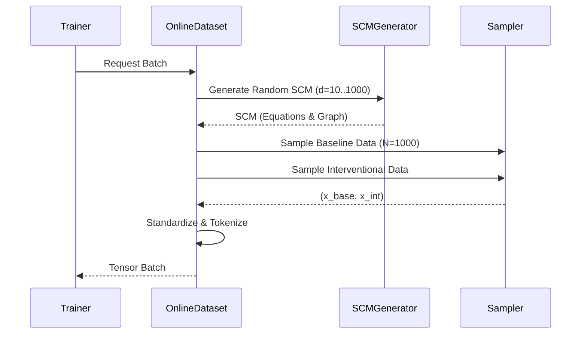

# Structure-Agnostic Causal Transformer (ISD-CP)


## 🌟 Overview

**ISD-CP** (Implicit Structure Discovery - Causal Prediction) is a cutting-edge, scalable Transformer model designed to revolutionize how we predict the consequences of interventions on tabular data.

Unlike traditional Causal Bayesian Networks that rely on explicit, often brittle, DAG discovery algorithms (like PC or GES), ISD-CP treats causal inference as an **end-to-end regression problem**. By leveraging the self-attention mechanism of Transformers, it implicitly learns the complex, non-linear causal dependencies between variables directly from data, without ever needing a graph as input.

### Why ISD-CP?
*   **Structure-Agnostic**: No need for prior knowledge of the causal graph.
*   **Infinite Scalability**: Trained on an infinite stream of synthetic Structural Causal Models (SCMs) generated on-the-fly.
*   **Zero-Shot Generalization**: Capable of predicting interventions on unseen causal systems immediately.

---

## 📐 Problem Formulation

We consider a causal system represented by a Structural Causal Model (SCM) $\mathcal{M} = (\mathbf{X}, \mathbf{U}, \mathbf{F}, P(\mathbf{U}))$, where $\mathbf{X} = \{X_1, \dots, X_d\}$ are endogenous variables and $\mathbf{U}$ are exogenous noise variables.

The goal is to predict the distribution of the system under an intervention $\text{do}(X_i = x)$.

Formally, given:
1.  A **Baseline** observation vector: $\mathbf{x}^{(b)} \sim P_{\mathcal{M}}(\mathbf{X})$
2.  An **Intervention** tuple: $(k, \alpha)$, where we set $X_k \leftarrow \alpha$.

The model $f_\theta$ predicts the expected value of the remaining variables:

$$ \hat{\mathbf{x}}^{(int)} = f_\theta(\mathbf{x}^{(b)}, k, \alpha) \approx \mathbb{E}[ \mathbf{X} \mid \text{do}(X_k = \alpha), \mathbf{x}^{(b)}_{\text{parents}} ] $$

To ensure generalizability across different scales, all inputs are standardized relative to the baseline statistics $\mu^{(b)}, \sigma^{(b)}$.

---

## 🏗️ Architecture

ISD-CP utilizes a modified Transformer Encoder architecture optimized for tabular data.

```mermaid
graph TD
    subgraph Input Processing
        B[Baseline Values] --> Emb[Feature Embedding]
        I[Intervention Token] --> Emb
        M[Masks] --> Emb
        Emb --> Pos[Variable ID Embedding]
    end

    subgraph Transformer Core
        Pos --> L1[Layer 1: Self-Attention]
        L1 --> L2[Layer 2: Self-Attention]
        L2 --> LN[...]
        LN --> LN_Final[Layer N: Self-Attention]
    end

    subgraph Prediction Head
        LN_Final --> MLP[MLP Projection]
        MLP --> Out[Predicted Post-Intervention State]
    end

    Input Processing --> Transformer Core
    Transformer Core --> Prediction Head
```

### Key Components
1.  **TabPFN-Style Embeddings**: Maps scalar values to high-dimensional vectors using learned prototypes.
2.  **Masked Attention**: Ensures the model respects the intervention (e.g., the intervened variable $X_k$ is fixed).
3.  **Implicit DAG Extraction**: Attention weights $\mathbf{A}$ in the final layers approximate the adjacency matrix of the underlying causal graph.

---

## 🔄 Data Generation Pipeline

We solve the data scarcity problem by generating data **online**. We do not read from a static dataset; instead, we create a new random SCM for every batch.



*   **Infinite Variety**: Random DAGs, mixed mechanisms (Linear, MLP, Sigmoid), and diverse noise distributions.
*   **Zero Storage**: No disk I/O bottlenecks. 1.9TB of equivalent static data is generated in RAM.

---

## 🚀 Installation

1.  **Clone the repository**:
    ```bash
    git clone https://github.com/yourusername/ISD-CP.git
    cd ISD-CP
    ```

2.  **Set up the environment**:
    ```bash
    python3 -m venv venv
    source venv/bin/activate
    pip install -r requirements.txt
    ```

---

## 💻 Usage

### Training
Start a production-grade training run. The system will automatically utilize available GPUs.

```bash
python -m src.train.train --output_dir checkpoints_prod --num_scms 1000 --epochs 500
```

| Argument | Default | Description |
| :--- | :--- | :--- |
| `--num_scms` | 100 | Number of unique SCMs to generate per epoch. |
| `--batch_size` | 100 | Samples per update step. |
| `--min_vars` | 10 | Minimum number of variables in a generated SCM. |
| `--max_vars` | 1000 | Maximum number of variables (dynamic scaling). |
| `--lr` | 1e-4 | Learning rate. |

### Monitoring
We provide rich logging via TensorBoard. Track Loss, Structural Hamming Distance (SHD), and F1 Scores in real-time.

```bash
tensorboard --logdir checkpoints_prod/logs
```

---

## 📂 Project Structure

```text
ISD-CP/
├── src/
│   ├── data/
│   │   ├── scm_generator.py    # 🎲 The Engine: Generates random SCMs
│   │   ├── dataset.py          # 🔄 Online Dataset implementation
│   │   └── processor.py        # 📊 Standardization logic
│   ├── model/
│   │   └── transformer.py      # 🧠 The Brain: Causal Transformer
│   └── train/
│       └── train.py            # 🏋️ Training entry point
├── configs/                    # ⚙️ YAML configurations
├── checkpoints_prod/           # 💾 Saved models and logs
└── requirements.txt            # 📦 Dependencies
```

---

## 📜 History & Changelog

### Phase I: Causal Data Engineer (CDE)
*   ✅ Implemented `SCMGenerator` for synthetic SCMs.
*   ✅ Built `DataSampler` for baseline/interventional sampling.

### Phase II: ML Engineer (MLE)
*   ✅ Developed `CausalTransformer` architecture.
*   ✅ Implemented robust `Trainer` loop.

### Phase III: ML Architect (MLA) & Scaling
*   🚀 **Online Data Generation**: Moved from disk to RAM, enabling infinite data.
*   📈 **Dynamic Scaling**: Support for 10-1000 variables per SCM.
*   🔍 **Attention Extraction**: Implicit DAG discovery via attention weights.
*   ⚡ **GPU Optimization**: Full CUDA utilization.

---

## 📄 License
This project is licensed under the [MIT License](LICENSE).
